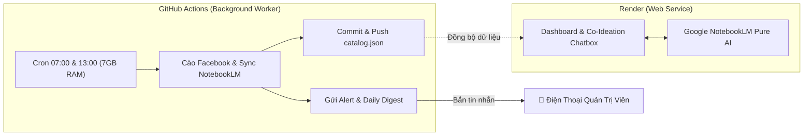

# 🚀 HƯỚNG DẪN VẬN HÀNH & TRIỂN KHAI DỊCH VỤ (OPERATIONS & RENDER DEPLOYMENT)

Tài liệu hướng dẫn toàn diện cách thiết lập hệ thống cảnh báo tức thì, báo cáo kết quả định kỳ qua **Telegram Bot**, và triển khai dịch vụ lên **Render**.

---

## 1. Hướng Dẫn Cấu Hình Telegram Bot (Mất 2 Phút)

Hệ thống sử dụng Telegram Bot API trực tiếp để:
- 🚨 **Bắn Cảnh Báo Khẩn Cấp (Instant Alert)**: Khi Facebook chặn IP/đổi giao diện, Google NotebookLM hết hạn session, hoặc tiến trình bị lỗi.
- 📊 **Báo Cáo Hàng Ngày (Daily Digest)**: Đúng 07:00 sáng mỗi ngày, tự động gửi báo cáo tóm tắt 24h (số repo mới, top dự án đột phá, ý tưởng Co-Ideation gợi ý).

### Bước 1: Tạo Bot và Lấy `BOT_TOKEN`
1. Mở Telegram, tìm kiếm **`@BotFather`** (có dấu tích xanh xác thực).
2. Bấm `Start` hoặc gõ `/newbot`.
3. Nhập tên hiển thị cho bot (ví dụ: `FB Repo Harvester Bot`).
4. Nhập username kết thúc bằng `bot` (ví dụ: `my_repo_harvester_bot`).
5. BotFather sẽ gửi cho bạn một chuỗi **HTTP API Token** dạng:
   `7123456789:AAFlm3kK9X...` &rarr; Đây chính là **`TELEGRAM_BOT_TOKEN`**.

### Bước 2: Lấy `CHAT_ID` Cá Nhân Hoặc Nhóm
1. Tìm kiếm **`@userinfobot`** trên Telegram và bấm `Start`.
2. Bot sẽ phản hồi lại thông tin của bạn, trong đó có trường `Id: 123456789` &rarr; Đây chính là **`TELEGRAM_CHAT_ID`**.
*(Nếu muốn gửi vào Nhóm / Kênh: Thêm bot vào nhóm, cấp quyền Admin, rồi dùng `@RawDataBot` để lấy ID nhóm có dấu trừ `-100...`)*.

### Bước 3: Kiểm Tra Kết Nối
- Mở Web UI tại tab **Vận Hành & Giám Sát (24/7)** (`http://localhost:7860`).
- Nhập `Token` và `Chat ID`.
- Bấm **"Gửi Thử Tin Nhắn Kiểm Tra"**. Bạn sẽ nhận được tin nhắn xác nhận ngay lập tức trên điện thoại!

---

## 2. Phương Án Triển Khai Lên Render

Render Free Tier có 3 đặc tính cần lưu ý:
- **RAM 512 MB**: Playwright Chromium ngốn RAM nếu chạy liên tục.
- **Sleep sau 15 phút**: Nếu không có HTTP request, Render sẽ đưa container vào chế độ ngủ (spin-down).
- **Ephemeral Storage**: Ổ đĩa bị reset khi container khởi động lại hoặc deploy phiên bản mới.

Vì vậy, có 2 phương án triển khai tùy theo nhu cầu của bạn:

---

### Phương Án A: Mô Hình Hybrid (Khuyên Dùng - 100% Free & Ổn Định Tuyệt Đối)

- **Render Web Service**: Chỉ phục vụ giao diện Web Dashboard và Chatbox Co-Ideation kết nối NotebookLM. Cực kỳ nhẹ (~80MB RAM), không cần chạy browser ngầm, mượt mà và không bao giờ bị nghẽn.
- **GitHub Actions Worker**: Tự động chạy cào Facebook theo lịch trình `.github/workflows/daily_harvest.yml` hoàn toàn miễn phí, có RAM 7GB, không bao giờ lo sleep, tự commit dữ liệu và gửi Daily Digest về Telegram.

#### Các bước triển khai:
1. Đẩy mã nguồn dự án lên GitHub Repository của bạn.
2. Vào **Settings** &rarr; **Secrets and variables** &rarr; **Actions** trên GitHub Repo:
   - Thêm Secret: `TELEGRAM_BOT_TOKEN`
   - Thêm Secret: `TELEGRAM_CHAT_ID`
   *(Tùy chọn: `NLM_TOKENS_JSON` nếu muốn GitHub Actions sync trực tiếp Google NotebookLM)*.
3. Đăng nhập [render.com](https://render.com), chọn **New +** &rarr; **Web Service**.
4. Kết nối với GitHub Repository của bạn.
5. Chọn Runtime: **Docker** (Render sẽ tự động dùng file `Dockerfile`).
6. Đặt tên service (ví dụ `fb-repo-harvester`), chọn Plan **Free**.
7. Bấm **Create Web Service**. Render sẽ build và cấp cho bạn một domain HTTPS (ví dụ `https://fb-repo-harvester.onrender.com`).

---

### Phương Án B: Mô Hình All-in-One trên Render (Docker Web + Scheduler)

Nếu bạn muốn toàn bộ hệ thống (Web + Scheduler cào ngầm) cùng chạy trên 1 container Render duy nhất:

#### Bước 1: Deploy Web Service qua Render Blueprint
1. Trên [render.com](https://render.com), chọn **New +** &rarr; **Blueprint**.
2. Chọn repo của bạn (Render sẽ tự đọc file `render.yaml`).
3. Điền các biến môi trường:
   - `TELEGRAM_BOT_TOKEN`
   - `TELEGRAM_CHAT_ID`
   - `AUTO_CRAWL_ENABLED`: `true`
   - `CRAWL_INTERVAL_HOURS`: `6`
   - `DAILY_REPORT_TIME`: `07:00`
4. Bấm Apply để Render khởi tạo dịch vụ.

#### Bước 2: Giữ Render Luôn Thức (Chống Sleep 15 Phút)
Hệ thống đã tích hợp sẵn endpoint kiểm tra sức khỏe siêu nhẹ:
`/api/health`

1. Truy cập [uptimerobot.com](https://uptimerobot.com) (hoặc [cron-job.org](https://cron-job.org)) - Hoàn toàn miễn phí.
2. Tạo một Monitor mới:
   - **Monitor Type**: `HTTP(s)`
   - **Friendly Name**: `FB Harvester Keep-Alive`
   - **URL**: `https://<ten-service-cua-ban>.onrender.com/api/health`
   - **Monitoring Interval**: `10 minutes`
3. Nhờ ping đều đặn mỗi 10 phút, Web Service trên Render sẽ **KHÔNG BAO GIỜ NGỦ**, Background Scheduler sẽ liên tục hoạt động để cào dữ liệu và gửi Daily Digest lúc 07:00 sáng!

---

## 3. Kiểm Tra Sau Triển Khai (Operational Verification)

Sau khi deploy, bạn có thể kiểm tra nhanh:

| Mục tiêu | Cách kiểm tra | Kết quả mong đợi |
| :--- | :--- | :--- |
| **Health Check** | Truy cập `https://<domain>/api/health` | Trả về JSON status `"healthy"`, trạng thái scheduler và NotebookLM |
| **Telegram Bot** | Vào tab *Vận Hành* trên UI bấm "Gửi Thử Tin Nhắn" | Nhận ngay tin nhắn `[KIỂM TRA KẾT NỐI THÀNH CÔNG]` trên Telegram |
| **Daily Digest** | Vào tab *Vận Hành* bấm "Gửi Báo Cáo Ngay" | Nhận ngay bản báo cáo tổng hợp 24h kèm thống kê và top repo |
| **Co-Ideation Chatbox** | Hỏi bất kỳ câu hỏi nào trong tab Idea Lab | Phản hồi sâu từ 29 repos và NotebookLM |
