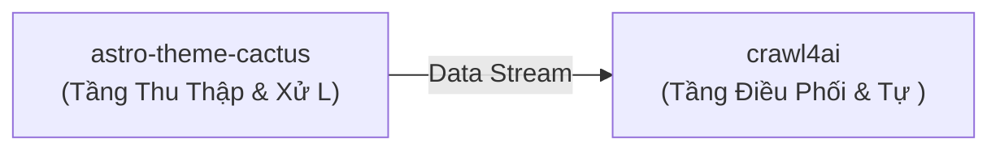

# 💡 Đề Xuất Ý Tưởng Đột Phá: Hệ Thống Tích Hợp Đột Phá: astro-theme-cactus & crawl4ai

> **Giá trị cốt lõi**: *Tự động hóa quy trình nghiệp vụ bằng phối hợp Fullstack, Web & UI Frameworks và Data Scraping & Web Automation*

- **Mã định danh**: `idea_1788625888_8508` | Ngày tạo: `2026-09-05 23:31:28`
- **Chế độ phát sinh**: `surprise`
- **Các Repository tham gia**: `chrismwilliams/astro-theme-cactus`, `unclecode/crawl4ai`

## 🎯 1. Vấn Đề Đặt Ra (Problem Statement)
Sự thiếu hụt cầu nối giữa chrismwilliams/astro-theme-cactus (Fullstack, Web & UI Frameworks) và unclecode/crawl4ai (Data Scraping & Web Automation) tạo ra điểm nghẽn thủ công trong quy trình.

## 🚀 2. Tổng Quan Giải Pháp Phối Hợp (Synergy Solution)
Xây dựng đường ống dữ liệu khép kín: chrismwilliams/astro-theme-cactus làm tầng trích xuất/xử lý ban đầu và unclecode/crawl4ai làm tầng tổng hợp/điều phối nâng cao.

### 🧩 Phân Công Vai Trò Kiến Trúc:
- **`chrismwilliams/astro-theme-cactus`**: Tầng Thu Thập & Xử Lý Nguồn (Astro)
- **`unclecode/crawl4ai`**: Tầng Điều Phối & Tự Động Hóa (Python)

## 🔄 3. Luồng Dữ Liệu (Data Flow)
- Bước 1: Trích xuất hoặc chuẩn bị dữ liệu từ chrismwilliams/astro-theme-cactus.
- Bước 2: Chuẩn hóa payload qua giao thức IPC hoặc JSON trung gian.
- Bước 3: Thực thi tác vụ tự động trên unclecode/crawl4ai và trả về kết quả tổng hợp.



## 💻 4. Mã Keo Thực Chiến (Proof-of-Concept Glue Code)
```python
# Mã keo (PoC Glue Code) kết nối chrismwilliams/astro-theme-cactus và unclecode/crawl4ai
# Hướng dẫn cài đặt nhanh:
# npx create-astro@latest my-site --template chrismwilliams/astro-theme-cactus
# pip install crawl4ai

import os
import sys
import time

def run_synergy_pipeline():
    print('🚀 [Pipeline] Đang nạp module dữ liệu: chrismwilliams/astro-theme-cactus...')
    # TODO: Gọi logic từ repo thứ nhất
    payload = {'status': 'success', 'source': 'Repo A'}

    print('🔄 [Pipeline] Chuyển tiếp luồng điều phối sang: unclecode/crawl4ai...')
    # TODO: Xử lý qua repo thứ hai
    result = f'Xử lý thành công từ payload: {payload}'
    print('✅ [Pipeline] Hoàn tất:', result)
    return result

if __name__ == '__main__':
    run_synergy_pipeline()
```

## ⚠️ 5. Đánh Giá Rủi Ro & Biện Pháp Khắc Phục (Risk & Feasibility)
- 🔴 **Rủi ro**: Khác biệt môi trường runtime hoặc ngôn ngữ lập trình
  - 🟢 **Khắc phục**: Sử dụng Docker Compose hoặc CLI Subprocess để bọc giao tiếp.
- 🔴 **Rủi ro**: Quá tải tài nguyên khi xử lý đồng thời
  - 🟢 **Khắc phục**: Bổ sung hàng đợi message queue hoặc buffer đệm.