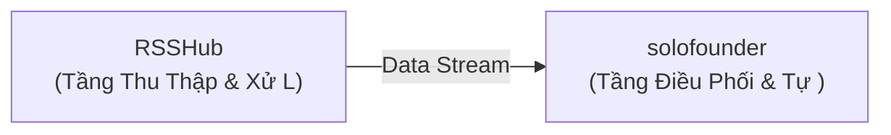

# 💡 Đề Xuất Ý Tưởng Đột Phá: Hệ Thống Tích Hợp Đột Phá: RSSHub & solofounder

> **Giá trị cốt lõi**: *Tự động hóa quy trình nghiệp vụ bằng phối hợp Backend & High-Performance Systems và AI & Autonomous Agents*

- **Mã định danh**: `idea_1788625898_5923` | Ngày tạo: `2026-09-05 23:31:38`
- **Chế độ phát sinh**: `goal`
- **Đề bài người dùng**: *cào tin tức dữ liệu web tự động và dùng agent tóm tắt*
- **Các Repository tham gia**: `DIYgod/RSSHub`, `solofounder-ai/solofounder`, `openclaw/openclaw`

## 🎯 1. Vấn Đề Đặt Ra (Problem Statement)
Sự thiếu hụt cầu nối giữa DIYgod/RSSHub (Backend & High-Performance Systems) và solofounder-ai/solofounder (AI & Autonomous Agents) tạo ra điểm nghẽn thủ công trong quy trình.

## 🚀 2. Tổng Quan Giải Pháp Phối Hợp (Synergy Solution)
Xây dựng đường ống dữ liệu khép kín: DIYgod/RSSHub làm tầng trích xuất/xử lý ban đầu và solofounder-ai/solofounder làm tầng tổng hợp/điều phối nâng cao.

### 🧩 Phân Công Vai Trò Kiến Trúc:
- **`DIYgod/RSSHub`**: Tầng Thu Thập & Xử Lý Nguồn (TypeScript)
- **`solofounder-ai/solofounder`**: Tầng Điều Phối & Tự Động Hóa (JavaScript)

## 🔄 3. Luồng Dữ Liệu (Data Flow)
- Bước 1: Trích xuất hoặc chuẩn bị dữ liệu từ DIYgod/RSSHub.
- Bước 2: Chuẩn hóa payload qua giao thức IPC hoặc JSON trung gian.
- Bước 3: Thực thi tác vụ tự động trên solofounder-ai/solofounder và trả về kết quả tổng hợp.



## 💻 4. Mã Keo Thực Chiến (Proof-of-Concept Glue Code)
```python
# Mã keo (PoC Glue Code) kết nối DIYgod/RSSHub và solofounder-ai/solofounder
# Hướng dẫn cài đặt nhanh:
# git clone https://github.com/DIYgod/RSSHub.git && cd RSSHub && npm install && npm start
# npm install solofounder

import os
import sys
import time

def run_synergy_pipeline():
    print('🚀 [Pipeline] Đang nạp module dữ liệu: DIYgod/RSSHub...')
    # TODO: Gọi logic từ repo thứ nhất
    payload = {'status': 'success', 'source': 'Repo A'}

    print('🔄 [Pipeline] Chuyển tiếp luồng điều phối sang: solofounder-ai/solofounder...')
    # TODO: Xử lý qua repo thứ hai
    result = f'Xử lý thành công từ payload: {payload}'
    print('✅ [Pipeline] Hoàn tất:', result)
    return result

if __name__ == '__main__':
    run_synergy_pipeline()
```

## ⚠️ 5. Đánh Giá Rủi Ro & Biện Pháp Khắc Phục (Risk & Feasibility)
- 🔴 **Rủi ro**: Khác biệt môi trường runtime hoặc ngôn ngữ lập trình
  - 🟢 **Khắc phục**: Sử dụng Docker Compose hoặc CLI Subprocess để bọc giao tiếp.
- 🔴 **Rủi ro**: Quá tải tài nguyên khi xử lý đồng thời
  - 🟢 **Khắc phục**: Bổ sung hàng đợi message queue hoặc buffer đệm.