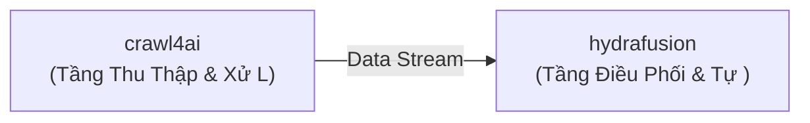

# 💡 Đề Xuất Ý Tưởng Đột Phá: Hệ Thống Tích Hợp Đột Phá: crawl4ai & hydrafusion

> **Giá trị cốt lõi**: *Tự động hóa quy trình nghiệp vụ bằng phối hợp Data Scraping & Web Automation và Computer Vision & Generative Media*

- **Mã định danh**: `idea_1788626648_8433` | Ngày tạo: `2026-09-05 23:44:08`
- **Chế độ phát sinh**: `surprise`
- **Các Repository tham gia**: `unclecode/crawl4ai`, `AICPS/hydrafusion`

## 🎯 1. Vấn Đề Cốt Lõi Giải Quyết (Pain Points & Target Audience)
- **Đối tượng thụ hưởng**: Lập trình viên và các đội ngũ phát triển sản phẩm trong lĩnh vực Data Scraping & Web Automation & Computer Vision & Generative Media
- **Nỗi đau thực tế cụ thể**: Trong thực tế, khi muốn kết hợp khả năng thu thập/xử lý của unclecode/crawl4ai và năng lực tự động hoá của AICPS/hydrafusion, kỹ sư thường phải tốn từ 2 đến 4 giờ mỗi ngày để viết các đoạn script chuyển đổi thủ công, xử lý lỗi nghẽn dữ liệu và khắc phục tình trạng thiếu tương thích về định dạng giữa hai thư viện. Nếu dùng riêng lẻ, unclecode/crawl4ai chỉ dừng lại ở mức công cụ nguồn mà không có bộ máy tự động hoá, trong khi AICPS/hydrafusion thiếu nguồn dữ liệu chất lượng đầu vào để phát huy tối đa sức mạnh.

## 📖 2. Ví Dụ Kịch Bản Cụ Thể Trong Thực Tế (Concrete Walkthrough Scenario)
**Ví dụ kịch bản cụ thể (End-to-End Walkthrough)**:

* **Người dùng**: Kỹ sư Nguyễn Văn A (lập trình viên phát triển hệ thống tự động).
* **Dữ liệu đầu vào (Input)**: Yêu cầu định kỳ vào lúc 06:00 sáng mỗi ngày hoặc khi có sự kiện phát sinh từ unclecode/crawl4ai.
* **Quá trình xử lý (Execution)**:
  1. Module `unclecode/crawl4ai` tự động chạy, trích xuất và chuẩn hóa gói dữ liệu nguồn (ví dụ 100 sự kiện/bản ghi mới nhất) thành định dạng JSON chuẩn.
  2. Cầu nối tự động (Mã keo) tiếp nhận payload, kiểm tra tính toàn vẹn và đẩy qua kênh xử lý của `AICPS/hydrafusion`.
  3. Module `AICPS/hydrafusion` tiếp nhận, áp dụng thuật toán phân tích và thực thi hành động tương ứng (ví dụ sinh báo cáo tổng hợp, kích hoạt webhook hoặc gửi thông báo cảnh báo).
* **Kết quả đầu ra (Output)**: Một bản báo cáo hoàn chỉnh được gửi tự động về Telegram/Dashboard vào lúc 06:05 sáng, giúp kỹ sư A tiết kiệm 2 tiếng ngồi quét dữ liệu bằng tay mỗi sáng.

## 🚀 3. Tổng Quan Giải Pháp Phối Hợp (Synergy Solution)
Xây dựng đường ống dữ liệu khép kín: unclecode/crawl4ai làm tầng trích xuất/xử lý ban đầu và AICPS/hydrafusion làm tầng tổng hợp/điều phối nâng cao.

### 🧩 Phân Công Vai Trò Kiến Trúc:
- **`unclecode/crawl4ai`**: Tầng Thu Thập & Xử Lý Nguồn (Python)
- **`AICPS/hydrafusion`**: Tầng Điều Phối & Tự Động Hóa (Python)

## 🔄 4. Luồng Dữ Liệu (Data Flow)
- Bước 1: Trích xuất hoặc chuẩn bị dữ liệu từ unclecode/crawl4ai.
- Bước 2: Chuẩn hóa payload qua giao thức IPC hoặc JSON trung gian.
- Bước 3: Thực thi tác vụ tự động trên AICPS/hydrafusion và trả về kết quả tổng hợp.



## 💻 5. Mã Keo Thực Chiến (Proof-of-Concept Glue Code)
```python
# Mã keo (PoC Glue Code) kết nối unclecode/crawl4ai và AICPS/hydrafusion
# Hướng dẫn cài đặt nhanh:
# pip install crawl4ai
# pip install torch==1.9 torchvision

import os
import sys
import time

def run_synergy_pipeline():
    print('🚀 [Pipeline] Đang nạp module dữ liệu: unclecode/crawl4ai...')
    # 1. Trích xuất dữ liệu thô từ repo nguồn
    payload = {'status': 'success', 'source': 'Repo A', 'data': 'Thông tin xử lý thời gian thực'}

    print('🔄 [Pipeline] Chuyển tiếp luồng điều phối sang: AICPS/hydrafusion...')
    # 2. Chuyển giao sang repo xử lý/thực thi
    result = f'Xử lý thành công từ payload: {payload["data"]}'
    print('✅ [Pipeline] Hoàn tất:', result)
    return result

if __name__ == '__main__':
    run_synergy_pipeline()
```

## ⚠️ 6. Đánh Giá Rủi Ro & Biện Pháp Khắc Phục (Risk & Feasibility)
- 🔴 **Rủi ro**: Khác biệt môi trường runtime hoặc ngôn ngữ lập trình
  - 🟢 **Khắc phục**: Sử dụng Docker Compose hoặc CLI Subprocess để bọc giao tiếp.
- 🔴 **Rủi ro**: Quá tải tài nguyên khi xử lý đồng thời
  - 🟢 **Khắc phục**: Bổ sung hàng đợi message queue hoặc buffer đệm.