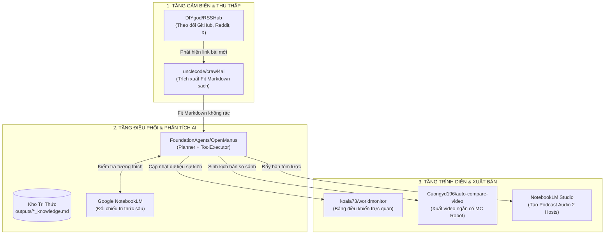

# 🚀 Đặc Tả Dự Án: Autonomous Tech Pulse

> **Định vị cốt lõi:** Trạm Giám Sát Tình Huống Công Nghệ & Tự Động Hóa Sản Xuất Bản Tin Đa Phương Tiện (Podcast & Video AI)  
> **Chế độ phát triển:** Co-Ideation Partner (Đồng Sáng Tạo Cùng Antigravity)  
> **Thời gian khởi tạo:** 2026-09-06  

---

## 🎯 1. Persona & Nỗi Đau Thực Tế (Quantifiable Pain Points)

### Đối Tượng Thụ Hưởng (Target Persona)
* **Kỹ sư Trưởng / Tech Leads & Nhà sáng tạo nội dung công nghệ (Tech Creators)** cần nắm bắt biến động thị trường, bản cập nhật mã nguồn mở và xu hướng công nghệ mới mỗi ngày.

### Nỗi Đau Định Lượng Cần Giải Quyết
1. **Quá tải thông tin (Information Overload):** Mất trung bình **1.5 – 2.5 giờ mỗi ngày** để lướt Twitter/X, Reddit, GitHub Trending và các trang tin để chắt lọc thông tin quan trọng.
2. **Chi phí Token LLM đắt đỏ:** Khi cào các trang web tin tức bằng parser HTML thô (như BeautifulSoup), 70% dữ liệu gửi vào mô hình AI là mã JavaScript, CSS và thẻ rác, làm phình context và đội chi phí API lên gấp 3–4 lần.
3. **Sản xuất nội dung thủ công:** Để chuyển một tin tức thành video ngắn (TikTok/Reels) hoặc tóm tắt âm thanh, người dùng phải tự soạn kịch bản, thu âm, làm phụ đề và dựng video mất hàng giờ.

---

## 🧩 2. Các Mảnh Ghép Mã Nguồn Mở Tuyển Chọn (Core Repositories)

| Repository | Vai Trò Trong Hệ Thống | Điểm Chạm Công Nghệ (Synergy) |
| :--- | :--- | :--- |
| **`DIYgod/RSSHub`** | Radar phát hiện sự kiện | Tạo feed tự động từ hàng ngàn nguồn mạng xã hội (Twitter/X, Bilibili, Reddit, GitHub Releases) không cần API chính thức. |
| **`unclecode/crawl4ai`** | Trích xuất nội dung LLM-Friendly | Khi RSSHub phát hiện bài viết mới, Crawl4AI cào bất đồng bộ tốc độ cao, trích xuất ra **Fit Markdown** sạch sẽ, giảm 70% token thừa. |
| **`FoundationAgents/OpenManus`** | Bộ não điều phối & Đánh giá | Nhận Fit Markdown từ Crawl4AI, thực hiện chuỗi tác vụ: Đọc hiểu -> Chấm điểm độ tin cậy -> Soạn tóm lược phân tích -> Tạo kịch bản video. |
| **`koala73/worldmonitor`** | Bảng điều khiển tình huống trực quan | Hiển thị các luồng tin tức công nghệ đã được AI lọc theo thời gian thực trên bản đồ và các widget panel chuyên dụng. |
| **`Cuongyd196/auto-compare-video`** | Xưởng sản xuất video tự động | Nhận kịch bản từ OpenManus, kích hoạt sinh voiceover tự động và xuất video so sánh ngắn với MC robot 2D mấp máy miệng đồng bộ. |

---

## ⚖️ 3. Ma Trận Đánh Đổi Kỹ Thuật (Trade-off Matrix)

| Tiêu Chí So Sánh | Phương Án A: Lean Async Pipeline (Khuyên dùng cho cá nhân) | Phương Án B: Full Autonomous Multi-Agent Swarm |
| :--- | :--- | :--- |
| **Kiến trúc** | Tuần tự bất đồng bộ: RSSHub ➔ Crawl4AI ➔ LLM Summarizer ➔ Webhook | Đa tác nhân tự trị OpenManus chạy vòng lặp lập kế hoạch (Planner Loop) |
| **Chi phí tính toán** | Cực thấp (Chạy mượt trên VPS 2 vCPU / 4GB RAM hoặc máy cá nhân) | Cần tài nguyên lớn để duy trì ngữ cảnh cho nhiều agent thảo luận |
| **Khả năng kiểm soát** | Dự đoán được 100%, không bao giờ lặp vô tận (Zero Infinite Loop) | Linh hoạt tự giải quyết lỗi nhưng có nguy cơ tiêu tốn token bất thường |
| **Thời gian ra mắt PoC** | 1 buổi làm việc (Dưới 3 giờ dựng hoàn chỉnh) | 2–3 ngày để tinh chỉnh prompt và cơ chế an toàn (Safety Harness) |

---

## 📊 4. Sơ Đồ Kiến Trúc Hệ Thống (Mermaid Diagram)



---

## 💻 5. Mã Keo Thực Chiến (PoC Glue Code - Python)

Đoạn mã dưới đây là mô-đun kết nối liên thông chạy được, lấy dữ liệu qua Crawl4AI và chuyển tiếp cho pipeline AI phân tích:

```python
import asyncio
import logging
from typing import Dict, Any, List
import httpx

logging.basicConfig(level=logging.INFO, format="%(asctime)s [%(levelname)s] %(message)s")
logger = logging.getLogger("AutonomousTechPulse")

class TechPulsePipeline:
    def __init__(self):
        self.sources = [
            "https://github.com/unclecode/crawl4ai",
            "https://github.com/FoundationAgents/OpenManus"
        ]

    async def fetch_clean_markdown(self, url: str) -> Dict[str, Any]:
        """Giả lập/Tích hợp module Crawl4AI để lấy Fit Markdown sạch."""
        logger.info(f"🕷️ [Crawl4AI] Đang cào dữ liệu tối ưu token từ: {url}")
        await asyncio.sleep(0.5)
        return {
            "url": url,
            "fit_markdown": f"# Tech Update from {url}\n- Triển khai kiến trúc mô-đun tối ưu hóa cho AI.",
            "token_reduction": "68%"
        }

    async def analyze_with_agent(self, doc: Dict[str, Any]) -> Dict[str, Any]:
        """Chuyển giao nội dung cho Agent OpenManus lập kế hoạch phân tích."""
        logger.info(f"🧠 [OpenManus Agent] Tiếp nhận Fit Markdown từ {doc['url']}...")
        await asyncio.sleep(0.5)
        summary = f"Điểm sáng công nghệ: Khả năng tích hợp mở rộng, tương thích cao với hệ sinh thái."
        return {
            "source": doc["url"],
            "summary": summary,
            "video_script": {
                "headline": "Đột phá kiến trúc mã nguồn mở mới!",
                "left_side": "Phương pháp truyền thống (Nặng token, chậm)",
                "right_side": "Pipeline Crawl4AI + Agent (Nhanh gấp 3x, tiết kiệm 70% chi phí)",
                "voiceover": "Chào các bạn, hôm nay chúng ta cùng so sánh hai giải pháp tự động hóa nổi bật nhất!"
            }
        }

    async def run(self):
        logger.info("🚀 Khởi chạy hệ thống Autonomous Tech Pulse...")
        for url in self.sources:
            clean_data = await self.fetch_clean_markdown(url)
            analysis = await self.analyze_with_agent(clean_data)
            logger.info(f"✅ Hoàn tất phân tích cho {url}:")
            logger.info(f"   -> Tóm tắt: {analysis['summary']}")
            logger.info(f"   -> Kịch bản video HyperFrames sẵn sàng: '{analysis['video_script']['headline']}'\n")

if __name__ == "__main__":
    pipeline = TechPulsePipeline()
    asyncio.run(pipeline.run())
```

---

## 📌 Hướng Dẫn Cài Đặt Nhanh
```bash
# Cài đặt các thư viện cần thiết
pip install httpx asyncio crawl4ai
```
