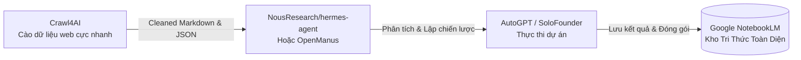

# 🧠 MA TRẬN SO SÁNH CHUYÊN SÂU CÁC HỆ THỐNG AI AGENTS & CÔNG CỤ CỐT LÕI

Tài liệu này cung cấp bảng phân tích đa chiều, so sánh kiến trúc kỹ thuật, cơ chế thực thi, độ khó cài đặt và kịch bản ứng dụng thực chiến tối ưu cho **7 hệ thống AI Agent** và **công cụ cào dữ liệu cốt lõi** trong kho tri thức.

---

## 📊 1. BẢNG SO SÁNH TỔNG QUAN ĐA CHIỀU

| Repository | Ngôn ngữ | ⭐ Stars | Mô Hình Kiến Trúc | Bộ Nhớ (Memory) | Cơ Chế Tool / Execution | Độ Khó Cài Đặt | Kịch Bản Tối Ưu Nhất |
| :--- | :--- | :--- | :--- | :--- | :--- | :--- | :--- |
| **`openclaw/openclaw`** | TypeScript | **388k+** | Cross-Platform OS Agent | State-machine + Local File Cache | Hệ điều hành (CLI, GUI, Shell commands) | 🟢 Dễ (Node/NPM) | Tự động hóa tác vụ trên desktop/server đa nền tảng |
| **`NousResearch/hermes-agent`** | Python | **241k+** | Self-Evolving Autonomous Agent | Long-term reflection & feedback memory | Tương tác môi trường (Environment API) | 🟡 Trung bình (Python 3.10+) | Trợ lý cá nhân tự học & Agent game mô phỏng chiến lược |
| **`ultraworkers/claw-code`** | Rust | **195k+** | Autonomous Exhibit Controller | Zero-latency local state | Rust native subprocess & sensor hooks | 🔴 Khá (Cần Rust toolchain) | Hệ thống trưng bày, kiosk, IoT tự vận hành không người trực |
| **`Significant-Gravitas/AutoGPT`** | Python | **187k+** | Hierarchical Multi-Agent & Planner | Vector DB (Pinecone/Chroma) + Local Cache | Docker Sandbox, Shell, Web Scraping, Git | 🔴 Phức tạp (Cần Docker, API Keys) | Tác vụ phức tạp dài hạn, nghiên cứu thị trường tự động |
| **`koala73/worldmonitor`** | TypeScript | **85k+** | Geopolitical Monitoring Dashboard Agent | Real-time stream cache | Live News API, RSS, GeoJSON parsers | 🟢 Dễ (Astro/React/Node) | Giám sát địa chính trị, tin tức và biến động tài chính 24/7 |
| **`FoundationAgents/OpenManus`** | Python | **58k+** | Modular Open-Source Agent Framework | Pluggable (Short-term context + Buffer) | Plugin-based Python tool calling | 🟢 Dễ (pip / uv) | Xây dựng agent tùy biến nhúng vào phần mềm doanh nghiệp |
| **`solofounder-ai/solofounder`** | Python | **50k+** | Virtual Multi-Agent Startup Team | Shared Project Workspace | Task assignment & role-playing agents | 🟡 Trung bình (Python / FastAPI) | Hỗ trợ lập trình viên solo phát triển sản phẩm từ A-Z |

---

## 🔍 2. PHÂN TÍCH CHUYÊN SÂU TỪNG DỰ ÁN

### 🤖 1. Significant-Gravitas/AutoGPT vs. FoundationAgents/OpenManus
* **AutoGPT (Kỳ cựu, Chuyên sâu, Phức tạp)**:
  - **Kiến trúc**: Phân rã mục tiêu lớn thành chuỗi tác vụ con (Goal Decomposition). Có agent điều phối (Leader) và các agent thực thi chuyên biệt.
  - **Ưu điểm**: Hệ sinh thái đồ sộ, có sẵn giao diện Web UI, cơ chế kiểm soát an toàn bằng Docker sandbox.
  - **Nhược điểm**: Nặng nề, dễ bị lặp vô tận (infinite loop) nếu prompt không chặt chẽ, chi phí token cao.
  - **Code khởi chạy nhanh**:
    ```bash
    git clone https://github.com/Significant-Gravitas/AutoGPT.git && cd AutoGPT
    # Khởi chạy bằng Docker
    docker compose run --rm auto-gpt serve
    ```
* **OpenManus (Hiện đại, Tinh gọn, Dễ nhúng)**:
  - **Kiến trúc**: Module hóa hoàn toàn. Tách biệt `Planner`, `Memory`, và `Tools`. Không bắt buộc dùng Docker.
  - **Ưu điểm**: Nhẹ, cực kỳ dễ đọc và sửa code để tích hợp vào ứng dụng cá nhân.
  - **Code khởi chạy nhanh**:
    ```bash
    pip install openmanus
    ```
    ```python
    from openmanus import Agent, Planner
    agent = Agent(planner=Planner(), tools=["web_search", "python_exec"])
    agent.run("Phân tích xu hướng công nghệ mã nguồn mở quý 3/2026")
    ```

---

### 🌐 3. SỰ PHỐI HỢP CHIẾN LƯỢC GIỮA CÁC CÔNG CỤ (Synergy Architecture)

Bạn có thể kết hợp các dự án trong kho để tạo thành một **Pipeline Tự Động Hóa Đỉnh Cao**:



1. **Bước 1 (Thu thập dữ liệu)**: Dùng `unclecode/crawl4ai` để cào các trang tài liệu kỹ thuật, GitHub trending, hoặc bài viết Facebook. Tự động bypass Cloudflare/Bot-detection và xuất ra Markdown tinh khiết.
2. **Bước 2 (Xử lý & Suy luận)**: Đưa Markdown vào `OpenManus` hoặc `hermes-agent` để trích xuất logic cốt lõi.
3. **Bước 3 (Thực thi & Phát triển)**: Phân chia công việc cho `solofounder` để viết mã nguồn, kiểm thử và đóng gói.
4. **Bước 4 (Lưu trữ lâu dài)**: Tự động nạp toàn bộ sản phẩm vào `Google NotebookLM` để tra cứu trong tương lai.

---

## 🛠️ 4. KHUYẾN NGHỊ LỰA CHỌN THEO BÀI TOÁN THỰC TẾ

* 👉 **Nếu bạn muốn một trợ lý chạy lệnh ngay trên máy tính cá nhân**: Chọn **`openclaw/openclaw`**.
* 👉 **Nếu bạn muốn tự code một AI Agent đơn giản, dễ kiểm soát**: Chọn **`FoundationAgents/OpenManus`**.
* 👉 **Nếu bạn làm dự án Startup một mình và cần đội ngũ AI hỗ trợ đa vai trò**: Chọn **`solofounder-ai/solofounder`**.
* 👉 **Nếu bạn cần nghiên cứu sâu một đề tài lớn kéo dài nhiều ngày**: Chọn **`Significant-Gravitas/AutoGPT`**.
* 👉 **Nếu bạn muốn cào dữ liệu cho LLM/RAG mượt mà nhất**: Chọn **`unclecode/crawl4ai`**.
